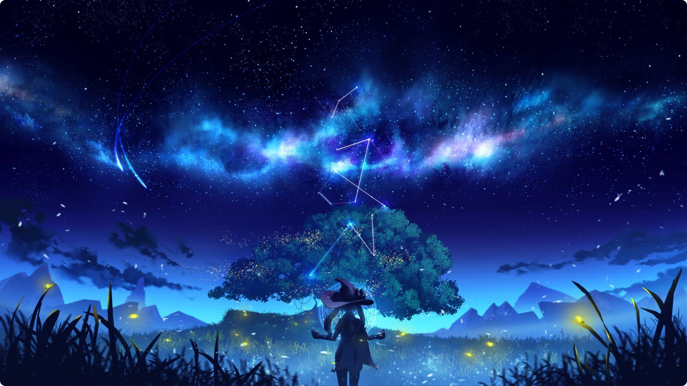

<!-- Version: v7.0.1 !-->

---

### Hi! I'm Maciupek

### 🔧 〢 What I'm currently working on?
❓ » None, currently

### 🔥 〢 My websites
❓ » None, currently

---

### 📝 〢 Currently Learning
- [x] C#
  - [x] Basics of C#
  - [ ] [Unity Engine](https://unity.com/download)
  - [x] [EXILED](https://github.com/Exiled-Team/EXILED/) API/Framework for SCP:SL
- [ ] [NextJS](https://nextjs.org)
- [x] HTML & CSS
- [ ] Java
  - [ ] Minecraft Modding 
  - [ ] [Fabric](https://fabricmc.net)

### 🌠 〢 Profile Views

 <i>Statistics collected since 03/07/2023.</i>

  

## 📊 〢 GitHub Analytics

  
  

 

---

<b>🛠️ Tools & Programs I use</b>

- **C# Editor:** [Visual Studio](https://visualstudio.microsoft.com/pl/)
- **Game Dev:** [Unity Engine](https://unity.com)
- **WebDev/Other Editor:** [Visual Studio Code](https://code.visualstudio.com/)
- **.dll De-compiler:** [Jetbrains dotPeek](https://www.jetbrains.com/decompiler/)

  

### 🌐 〢 Links

  

 

  

